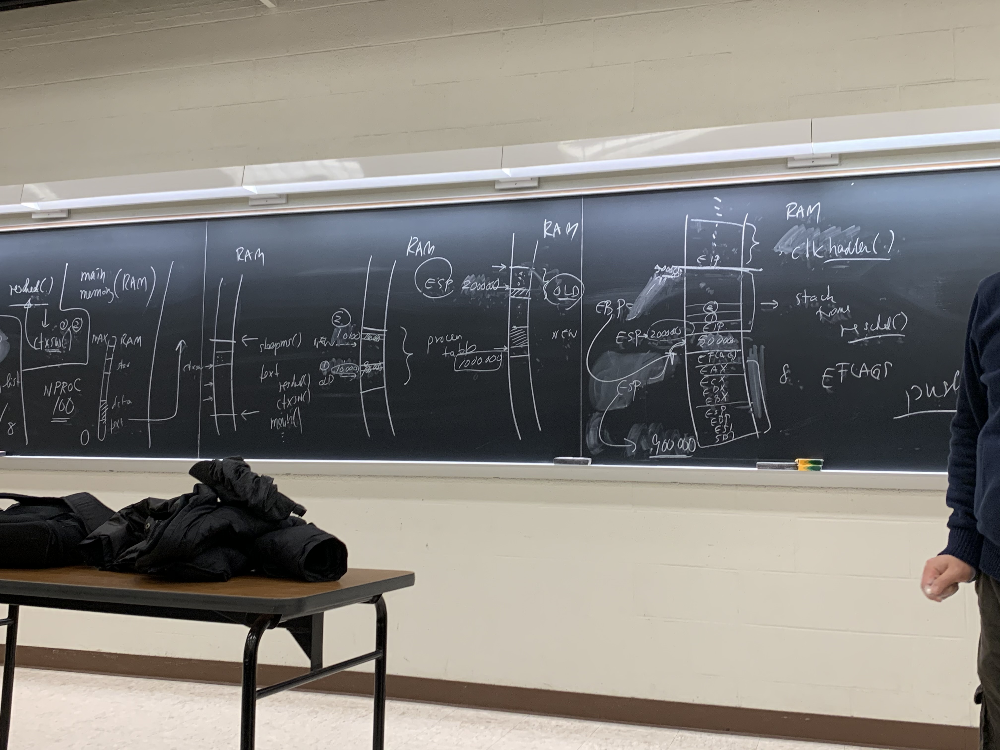

# Context Switching

RAM holds the state of our programs.

We have the function resched() which calls ctxsw().

At time T our function resched() (written in C) calls ctxsw (written in asm).

Our XINU ram looks like:

```
MAX
+---------------------+
|                     |
+---------------------+
|                     |
+---------------------+
|                     |
+---------------------+
|                     |
+---------------------+
|     stack           |
+---------------------+
|                     |
+---------------------+
|                     |
+---------------------+
|      data           |       +------------------------+
+---------------------+       |     sleepms()          |
|      text           | <     +------------------------+
+---------------------+       |     resched()          |
0                             +------------------------+ 
                              |     ctxsw()            |                                                                      
                              +------------------------+                                                                      
                              |     ...                |                                                                      
                              +------------------------+                                                                      
                              |                        |                                                                      
                              +------------------------+                                                                      
                              |                        |                                                                      
                              +------------------------+                                                                      
```                           

We haven't discussed memory allocation yet, but the process table is a global data structure with 100 rows, the number of NPROC. (that means up to 100 processes). o

So in the global data segment (all xinu processes share the same data), we have the proctab[100] data structure.

We have two processes, a *new* and an *old*. New is the process we're context switching to, old is the currently running process.

We are interested in the saved stack pointer of the old process and the location of the saved stack pointer in the new process. 

We want to grab ESP from the old process and save it to the old process' proctab entry. We then need to set ESP to the address of the new process' saved stack pointer, which is saved in the process table when it is context switched out. 

When we context switch from a process we push its EIP onto the stack.

Be aware that we need to save all our registers but we can't just do pushal/popal. We need to save the return value so be aware that we have to do a little more work.


Be sure to save ESP *AFTER* pushing all the registers to save its state.



We then jump into looking at ctxsw in the actual code.

```
/* ctxsw.S - ctxsw (for x86) */

		.text
		.globl	ctxsw

/*------------------------------------------------------------------------
 * ctxsw -  X86 context switch; the call is ctxsw(&old_sp, &new_sp)
 *------------------------------------------------------------------------
 */
ctxsw:
		pushl	%ebp		/* Push ebp onto stack		*/
		movl	%esp,%ebp	/* Record current SP in ebp	*/
		pushfl			/* Push flags onto the stack	*/
		pushal			/* Push general regs. on stack	*/

		/* Save old segment registers here, if multiple allowed */

		/* <- We know that ebp+8 holds the first argument to the function (old_sp) */
		movl	8(%ebp),%eax	/* Get mem location in which to	*/
					/*   save the old process's SP	*/
		movl	%esp,(%eax)	/* Save old process's SP	*/
		/* <- we know that ebp+12 holds the second argument to the function */
		movl	12(%ebp),%eax	/* Get location from which to	*/
					/*   restore new process's SP	*/

		/* The next instruction switches from the old process's	*/
		/*   stack to the new process's stack.			*/

		movl	(%eax),%esp	/* Pop up new process's SP	*/

		/* Restore new seg. registers here, if multiple allowed */

		popal			/* Restore general registers	*/
		movl	4(%esp),%ebp	/* Pick up ebp before restoring	*/
					/*   interrupts			*/
		popfl			/* Restore interrupt mask	*/
		add	$4,%esp		/* Skip saved value of ebp	*/
		ret			/* Return to new process	*/
```

We restore eflags after we restore the base pointer becaue restoring eflags may re-enable interrupts. 