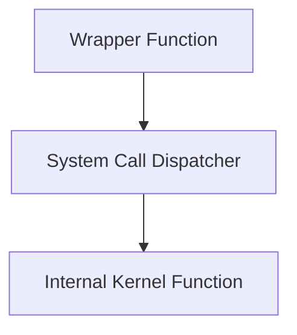

# Isolation / Protection V

In lab 2 we are implementing 2 (or 3) system calls in the fashion of true system calls.

The only compromise we are making for simplicity is that we are still not using user/kernel mode, all processes are created in kernel mode and stay in kernel mode throughout.

Never use putc(), use kprintf() instead.

We will use extended inline assembly to do our stuffs. (Smart ppl don't clobber)

Can look at clkdispatch to get an example.

Need to pushal which keeps the state. (GP regs, EFLAGS, CS, EIP)

ret doesn't expect to restore cs/eflags

iret does